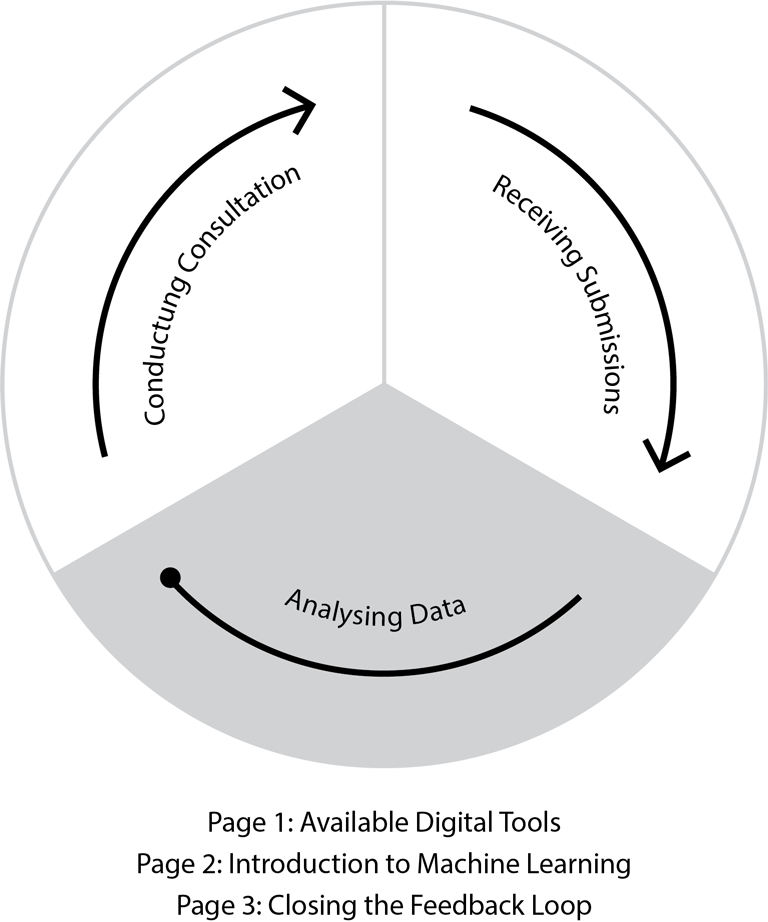

---
# Feel free to add content and custom Front Matter to this file.
# To modify the layout, see https://jekyllrb.com/docs/themes/#overriding-theme-defaults

title: Data Analytics for Policy
layout: home
---

## Welcome to this resource for Policy Practitioners

This website is a result of a Service Innovation Lab project with involvement from policy practitioners from across government exploring how to improve submission analysis processes, especially when dealing with large amounts of submissions.

  

## Pages

There are three pages on this website:

### **Available Tools**

This page has a list of tools used to process submissions on policy proposals and describes what they do.

[Analysis Tool Matrix](/bagel-box/matrix/)

Submissions Analysis and Machine Learning
This page explains and supports the understanding of machine learning use for submissions analysis. The page also includes a demonstration of a machine-learning-based software and a recommended approach to using it to give an early indication of key themes, which is particularly useful when processing large quantities of feedback.

[Machine Learning & Demo](/bagel-box/intro/)

### **Feeding back to those who submitted**

This page sets out how you can report the findings from engagement or consultation back to those who made a submission. The page shows how you might include your participants throughout your analysis process and finally close the feedback loop with them at the end of your analysis.

[Designing the Feedback Loop](/bagel-box/feedback-loop/)
