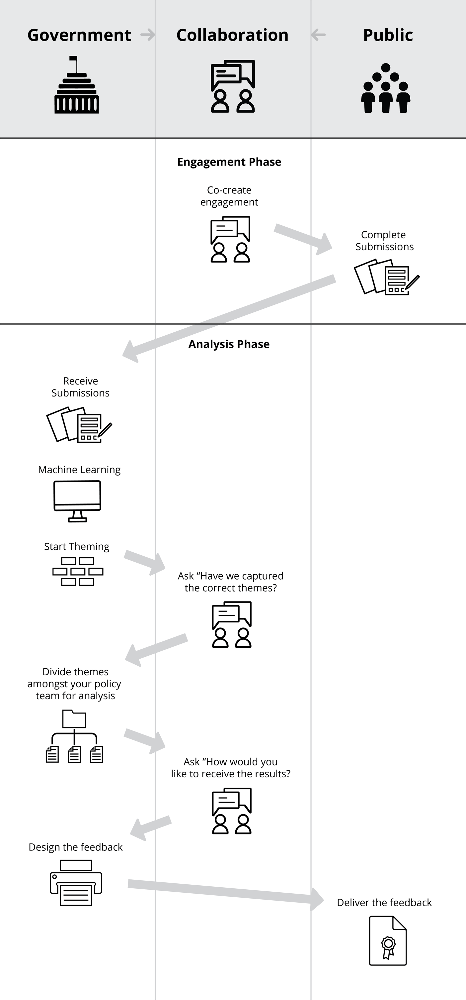

  
Learn some good practices around keeping your participants informed and engaged

  
<strong>In this page:</strong>

  <ol>
    <li><a href="#About-keeping-your-participants-informed">About keeping your participants informed</a></li>
    <li><a href="#What-it-involves">What it involves</a></li>
    <li><a href="#What-you-will-get-out-of-it">What you will get out of it</a></li>
    <li><a href="#Ideal-circumstances-for-use">Ideal circumstances for use</a></li>
    <li><a href="#Limitations">Limitations</a></li>
  </ol>

  <h3> About keeping your participants informed</h3>

  
For any engagement to be successful, it is essential that you communicate your findings back to your participants. Once you have finished the engagement, you want to keep them informed and involved and let them know you have heard them and that you value their input and knowledge. To build trust and to encourage people to stay involved, this process should be transparent. It is also ideal to consult with your participants on the format they would like to receive the feedback in. The format may be different depending on the community you are consulting with.

  
  <h3>What it involves</h3>

  
If you have a particular community you are getting advice from it makes it easier to decide what is the best way to keep them informed.

  
You can work with them to understand and design how the submissions received should be presented back to the community.  This process should be built into your timeframes early to guarantee there is sufficient time to allow this to happen.

  
There are many different ways the feedback can be presented back to the community, video format, infographics, social media etc. This should be checked to see if it is fit for purpose if it resonates and is accessible for the community you have engaged with.

  
Once you have designed how the feedback will be presented, this can then be released to the community, and where possible give them the opportunity to provide further feedback on the topic which can be incorporated into the end product/service.

  
<strong>Example: </strong><a href="https://www.the-hive.nz/">The Hive</a>

  

  
  <h3>What you will get out of it</h3>

  
Creating and releasing feedback in an accessible format that works for your audience will allow the targeted community to continue to be engaged with the process. If the community can see that their opinions have been captured and they know what will happen to the advice gathered, they are more likely to engage again in other consultations. They will feel heard and see the value in spending time having their say.

  
  <h3>Ideal circumstances for use</h3>

  
You should keep engaged with your community and ask them how they would like to be informed in any consultation that you are running. They will have ideas on the best way to present your findings back to them. The approach might change depending on who you are engaging with therefore the best practice is to co-design the approach with them.

  
<strong>Example: </strong><a href="https://www.the-hive.nz/">The Hive</a>

  
  
  <h3>Limitations</h3>

  
The participants you engage with when designing your feedback may not represent everyone in their community, so acknowledging and recognising this is important. Also due to government process and time pressures placed on consultations, this process is not always possible. If this is the case try and think about what is possible, what is the purpose of your feedback and who you want to access the feedback.

